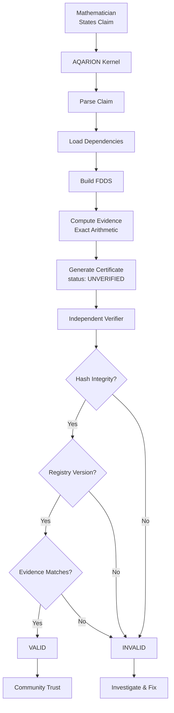
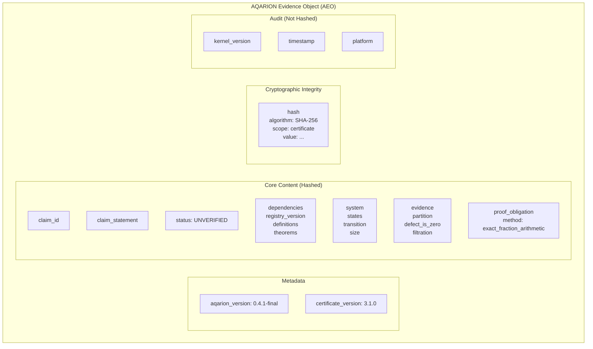
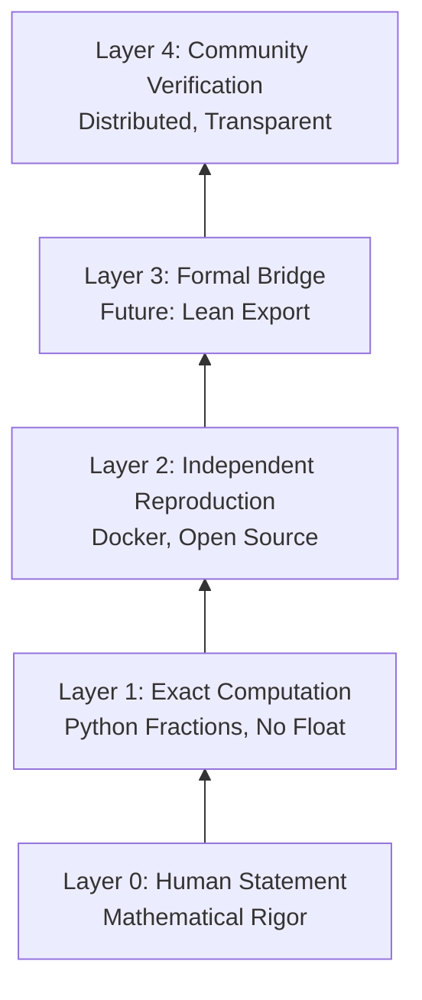
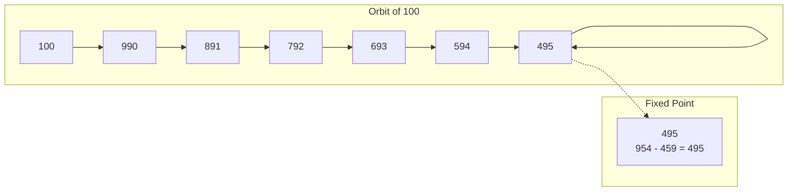
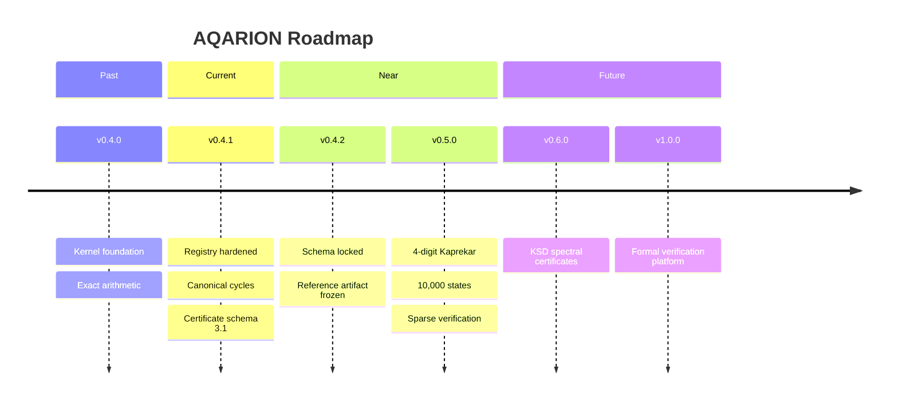
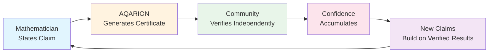
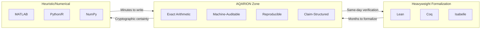
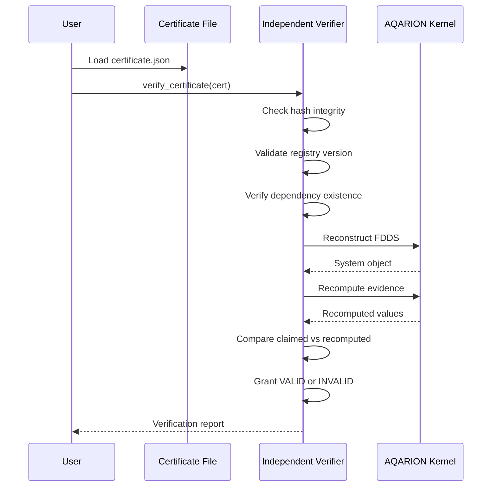

# ============================================================
# 7. AQARION-MERMAID.md — Mermaid Flowcharts
# ============================================================

mermaid = """# AQARION v0.4.1-final — Mermaid Diagrams

## 1. Evidence Pipeline Flow



## 2. Certificate Schema v3.1



## 3. Trust Architecture Layers



## 4. Kaprekar System (3-digit)



## 5. Defect Operator Visualization

```mermaid
flowchart TD
    subgraph GoodPartition["Good Partition (D=0)"]
        A1[Block A: {1,2}] --> B1[Block B: {3,4}]
        A2[Block C: {5,6}] --> B2[Block C: {7,8}]
    end
    
    subgraph BadPartition["Bad Partition (D≠0)"]
        A3[Block X: {1,2}] --> B3[Block Y: {3,4}]
        A4[Block X: {5,6}] --> B4[Block Z: {7,8}]
    end
    
    GoodPartition -->|f maps blocks to blocks| Valid["VALID<br/>Koopman-invariant"]
    BadPartition -->|f splits across blocks| Invalid["INVALID<br/>Defect ≠ 0"]
```

## 6. Version Roadmap



## 7. Community Engagement Flywheel



## 8. The "Missing Middle" Positioning



## 9. Certificate Verification Sequence



## 10. Sparse vs Dense Defect Check

```mermaid
flowchart TD
    subgraph Dense["Dense Defect Check<br/>O(|X|³)"]
        D1[Build K: Koopman matrix]
        D2[Build P: Projection matrix]
        D3[Compute D = (I-P)KP]
        D4[Check D = 0]
    end
    
    subgraph Sparse["Sparse Defect Check<br/>O(|X|)"]
        S1[For each block B]
        S2[Check f(B) ⊆ single block]
        S3[Return True/False]
    end
    
    Dense -->|Same result| Result["Partition is<br/>Koopman-invariant?"]
    Sparse -->|Same result| Result
    
    style Dense fill:#ffebee
    style Sparse fill:#e8f5e9
```
"""

with open(os.path.join(output_dir, "AQARION-MERMAID.md"), 'w') as f:
    f.write(mermaid)

print("✅ AQARION-MERMAID.md")
