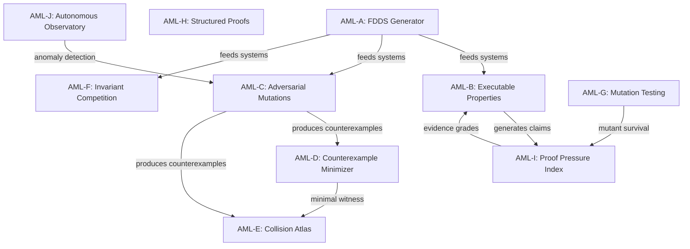
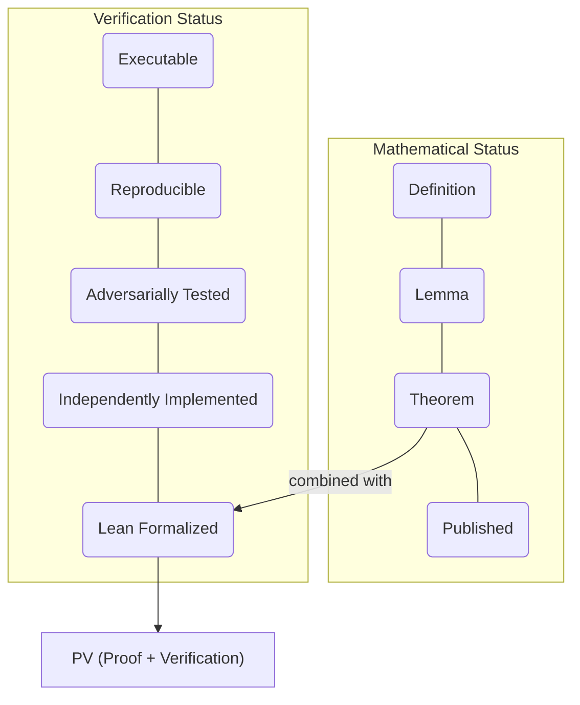
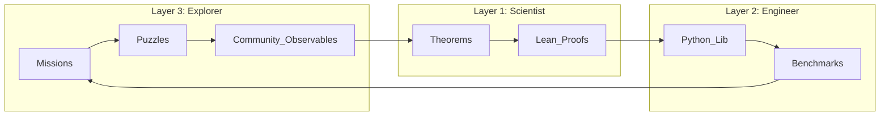

# AQARION ATLAS
## System Atlas · Notation Glossary · Mathematical Object Definitions
## Louisville Node #1 · Paper A8 · Kaprekar Spectral Geometry
## Updated: M21 2026

---

## §1. Core Systems — Three Distinct Objects (MUST NOT CONFLATE)

### System I: 715-State Digit-Multiset Quotient
- **ID:** AQ-DEF-001
- **States:** Unordered multisets of 4 digits from {0,...,9} = C(13,4) = 715
- **Map:** Induced by Kaprekar on multiset representatives
- **Status:** VERIFIED
- **Warning:** This is NOT the same as the image or the gap-pair quotient

### System II: 55-State Gap-Pair Quotient
- **ID:** AQ-DEF-002
- **States:** Equivalence classes under gap-pair structure = 55 states
- **Status:** VERIFIED
- **Warning:** MUST NOT conflate with System I or System III

### System III: 54-State Corrected Canonical Quotient (= Image)
- **ID:** AQ-DEF-003
- **States:** |Image(K_{10,4})| = 54 = T_{10} - 1 = C(11,2) - 1
- **Identity:** 54 = triangular number T_{10} minus 1 = C(11,2) - 1
- **Status:** VERIFIED [AQ-THM-001]
- **This is the primary object for Paper A8**

---

## §2. Domain Definitions

### Domain A
- **Contents:** Integers 1000–9999 without leading zeros
- **Size:** 8999 non-repdigit states
- **Depth sum:** ≈8990
- **Label correction:** Pre-M20 documents had A and B reversed [K-03]

### Domain B
- **Contents:** Padded 4-digit strings 0000–9999 (includes 0000–0999)
- **Size:** 9999 non-repdigit states (excludes repdigits 0000, 1111, ..., 9999)
- **Depth sum:** ≈9989
- **N_τ:** [383, 576, 2400, 1272, 1518, 1656, 2184] for τ=1,...,7
- **τ=3 peak:** N_τ(3) = 2400 is the dominant depth
- **Label correction:** Pre-M20 documents had A and B reversed [K-03]

---

## §3. Notation Glossary

| Symbol | Definition | Status |
|--------|-----------|--------|
| K_{b,d} | Kaprekar map in base b, d digits | V |
| |Image(K_{10,4})| | Size of image set = 54 | V |
| μₖ | k-th eigenvalue of normalized Laplacian | V |
| μ₁ | Fiedler eigenvalue (algebraic connectivity) | V |
| μ₁(A) | Fiedler eigenvalue, Domain A ≈ 0.16144 | V |
| μ₁(B) | Fiedler eigenvalue, Domain B ≈ 0.16243 | V |
| F_H | Gauge invariant ≈ 4.222 | V |
| N_τ | Count of states at depth τ | V |
| τ | Transient depth to attractor | V |
| D_τ | Defect operator for depth partition | V |
| defect_nonmarkov | = 0 universally | V |
| H_norm | Normalized basin entropy ∈ [0,1] | V |
| ρ(τ) | Recurrence density field (scaling limit) | C |
| μ_N | Empirical measure (1/N)Σδ(τ−τᵢ) | V |
| F[ρ] | Free energy functional | H |
| κ | Interaction coupling | H |
| κ_c(d,B) | Critical coupling (phase boundary) | C |
| ℒ | Transfer operator (Koopman approx) | C |
| φ(state) | Difference coordinate = max − min = p − r | V |
| δ | = φ(state) = p − r ∈ {1,...,B−1} | V |
| F(δ) | 1D map on difference coordinate | V |
| x* | Fixed point of Kaprekar map | V |
| T_{n} | Triangular number n(n+1)/2 | V |
| ι_3 | Image size map for d=3 negabase | H |
| Ω_{b,3} | State space of d=3 base-b Kaprekar | V |
| SPD-CCS | Spectral Phase Dynamics engine | V |
| AML | Adversarial Mathematics Laboratory | framework |
| AMF | Adversarial Mathematics Framework (12 modules) | framework |

---

## §4. The Kaprekar Map — Formal Definition

**d-digit base-b Kaprekar map** K_{b,d}: S → S where

S = {(x₀,...,x_{d-1}) : xᵢ ∈ {0,...,|b|−1}, not all xᵢ equal}

**Step 1:** Sort digits descending: desc = sort(x, ↓)  
**Step 2:** Sort digits ascending: asc = sort(x, ↑)  
**Step 3:** Compute diff = val(desc, b) − val(asc, b)  
where val uses standard positional notation  
**Step 4:** Represent diff as d-digit base-b number → next state

**Key identity for d=3:**
```
val(desc, B) - val(asc, B) = p·B² + q·B + r - (r·B² + q·B + p)
                           = (p-r)·B² + (r-p)
                           = (p-r)·(B² - 1)
```
Middle digit q **cancels completely**. [AQ-THM-010 Component A]

---

## §5. d=3 Theorem — Formal Statement and Proof Outline

**Theorem AQ-THM-010:** For any integer base B ≥ 2, the map K on 
non-repdigit 3-digit states with digits in {0,...,B−1} has exactly one 
fixed-point attractor. All trajectories converge to it. H_norm = 0.

**Proof outline:**

1. **Middle-digit cancellation** [VERIFIED]:  
   diff = (p−r)·(B²−1) where p=max, r=min of state

2. **Semiconjugacy to 1D** [VERIFIED]:  
   φ(state) = p−r defines F(δ) = next δ on {1,...,B−1}  
   Next state depends only on φ(current state)

3. **Fixed point formula** [VERIFIED for even B; INCOMPLETE for odd B — K-14]:  
   Even B: x* = (B/2−1, B−1, B/2)  
   Odd B: x* = ((B−1)/2, B−1, (B+1)/2)  

4. **Uniqueness** [VERIFIED computationally for B=2,...,16]:  
   F(δ) has unique fixed point on {1,...,B−1}  
   All trajectories converge → H_norm = 0

5. **Open:** Algebraic proof of uniqueness for all B (direct F(δ) analysis, not Banach)

---

## §6. Phase Diagram Summary

| Base | d=2 H | d=3 H | d=4 H | d=5 H | d=2 N |
|------|-------|-------|-------|-------|-------|
| −6   | 0.9915 | **0.0000** | 0.9579 | 0.7432 | 30 |
| −8   | 0.9794 | **0.0000** | 0.9419 | 0.8384 | 56 |
| −10  | 0.9848 | **0.0000** | **0.0000** | 0.9263 | 90 |
| −12  | 0.9969 | **0.0000** | 0.9355 | **0.0955** | 132 |
| −14  | 0.9970 | **0.0000** | 0.9724 | — | 182 |
| −16  | 0.9874 | **0.0000** | 0.8747 | — | 240 |

**Peak entropy: d=2 universally** [K-01 killed d=5 claim]  
**Anomalies:** b=−10,d=4 and b=−12,d=5 collapse [TARGET-05]

---

## §7. AMF Module Registry

| Module | Name | Function |
|--------|------|----------|
| A | Universal System Generator | GenerateFDDS(n, constraints, seed) over 13 families |
| B | Property Specification Language | Executable theorem properties, not hardcoded |
| C | Adversary Generator | 20+ mutation operators, tagged |
| D | Counterexample Reduction | Delta-debug to minimal witness |
| E | Collision Discovery Engine | Signature → Hash → Bucket → GI test → Atlas |
| F | Independent Oracle Layer | WL / nauty / Lean / sage / networkx |
| G | Mathematical Mutation Testing | Detect weak verification |
| H | Literature Adversary | Novel / Extension / Equivalent / Known / Conflict |
| I | Proof Pressure Score | Quantified verification strength |
| J | Autonomous Observatory | Continuous generation, anomaly clustering |
| K | Research Memory | Persistent failure archive, never rediscover |
| L | Research Graph | Full dependency/refutation/formalization graph |

---

## §8. Validation Pipeline

```
V0 Structure    → file exists, parses, fields present
V1 SHA256       → hash recorded, immutable
V2 Replay       → script reruns, same output
V3 Provenance   → seed, version, hardware documented
V4 Math Pred    → formal predicate verified (Lean target)
V5 Promotion    → claim advances in OVCR
```

---

## §9. Epistemic Tag Definitions

| Tag | Meaning |
|-----|---------|
| [V] VERIFIED | Exhaustive computational verification complete |
| [T] THEOREM | Proof exists (may have minor gaps) |
| [H] HEURISTIC | Motivated guess, partial support, not verified |
| [C] CONJECTURE | Stated precisely, no proof, not contradicted |
| [K] KILLED | False, flawed, or conflated — permanent record |

---

## §10. Open Problems Bounty

| # | Problem | Reward |
|---|---------|--------|
| 1 | Prove or disprove: F(δ) has unique FP for ALL B≥2 algebraically | A8 authorship acknowledgment |
| 2 | Derive κ_c(d,B) in closed form from N_τ | A8 co-authorship |
| 3 | Prove iota_3 universality: |T(Ω_{b,3})|=b for all b≥2 | A8 acknowledgment |
| 4 | Explain b=−12,d=5 collapse mechanism | A8 supplementary authorship |
| 5 | Lean proof of AQ-THM-001 (|Image|=54) | A8 formal methods section |

---

# AQARION ATLAS
## System Atlas · Notation Glossary · Mathematical Object Definitions
## Louisville Node #1 · Paper A8 · Kaprekar Spectral Geometry
## Updated: M21 2026

---

## §1. Core Systems — Three Distinct Objects (MUST NOT CONFLATE)

### System I: 715-State Digit-Multiset Quotient
- **ID:** AQ-DEF-001
- **States:** Unordered multisets of 4 digits from {0,...,9} = C(13,4) = 715
- **Map:** Induced by Kaprekar on multiset representatives
- **Status:** VERIFIED
- **Warning:** This is NOT the same as the image or the gap-pair quotient

### System II: 55-State Gap-Pair Quotient
- **ID:** AQ-DEF-002
- **States:** Equivalence classes under gap-pair structure = 55 states
- **Status:** VERIFIED
- **Warning:** MUST NOT conflate with System I or System III

### System III: 54-State Corrected Canonical Quotient (= Image)
- **ID:** AQ-DEF-003
- **States:** |Image(K_{10,4})| = 54 = T_{10} - 1 = C(11,2) - 1
- **Identity:** 54 = triangular number T_{10} minus 1 = C(11,2) - 1
- **Status:** VERIFIED [AQ-THM-001]
- **This is the primary object for Paper A8**

---

## §2. Domain Definitions

### Domain A
- **Contents:** Integers 1000–9999 without leading zeros
- **Size:** 8999 non-repdigit states
- **Depth sum:** ≈8990
- **Label correction:** Pre-M20 documents had A and B reversed [K-03]

### Domain B
- **Contents:** Padded 4-digit strings 0000–9999 (includes 0000–0999)
- **Size:** 9999 non-repdigit states (excludes repdigits 0000, 1111, ..., 9999)
- **Depth sum:** ≈9989
- **N_τ:** [383, 576, 2400, 1272, 1518, 1656, 2184] for τ=1,...,7
- **τ=3 peak:** N_τ(3) = 2400 is the dominant depth
- **Label correction:** Pre-M20 documents had A and B reversed [K-03]

---

## §3. Notation Glossary

| Symbol | Definition | Status |
|--------|-----------|--------|
| K_{b,d} | Kaprekar map in base b, d digits | V |
| |Image(K_{10,4})| | Size of image set = 54 | V |
| μₖ | k-th eigenvalue of normalized Laplacian | V |
| μ₁ | Fiedler eigenvalue (algebraic connectivity) | V |
| μ₁(A) | Fiedler eigenvalue, Domain A ≈ 0.16144 | V |
| μ₁(B) | Fiedler eigenvalue, Domain B ≈ 0.16243 | V |
| F_H | Gauge invariant ≈ 4.222 | V |
| N_τ | Count of states at depth τ | V |
| τ | Transient depth to attractor | V |
| D_τ | Defect operator for depth partition | V |
| defect_nonmarkov | = 0 universally | V |
| H_norm | Normalized basin entropy ∈ [0,1] | V |
| ρ(τ) | Recurrence density field (scaling limit) | C |
| μ_N | Empirical measure (1/N)Σδ(τ−τᵢ) | V |
| F[ρ] | Free energy functional | H |
| κ | Interaction coupling | H |
| κ_c(d,B) | Critical coupling (phase boundary) | C |
| ℒ | Transfer operator (Koopman approx) | C |
| φ(state) | Difference coordinate = max − min = p − r | V |
| δ | = φ(state) = p − r ∈ {1,...,B−1} | V |
| F(δ) | 1D map on difference coordinate | V |
| x* | Fixed point of Kaprekar map | V |
| T_{n} | Triangular number n(n+1)/2 | V |
| ι_3 | Image size map for d=3 negabase | H |
| Ω_{b,3} | State space of d=3 base-b Kaprekar | V |
| SPD-CCS | Spectral Phase Dynamics engine | V |
| AML | Adversarial Mathematics Laboratory | framework |
| AMF | Adversarial Mathematics Framework (12 modules) | framework |

---

## §4. The Kaprekar Map — Formal Definition

**d-digit base-b Kaprekar map** K_{b,d}: S → S where

S = {(x₀,...,x_{d-1}) : xᵢ ∈ {0,...,|b|−1}, not all xᵢ equal}

**Step 1:** Sort digits descending: desc = sort(x, ↓)  
**Step 2:** Sort digits ascending: asc = sort(x, ↑)  
**Step 3:** Compute diff = val(desc, b) − val(asc, b)  
where val uses standard positional notation  
**Step 4:** Represent diff as d-digit base-b number → next state

**Key identity for d=3:**
```
val(desc, B) - val(asc, B) = p·B² + q·B + r - (r·B² + q·B + p)
                           = (p-r)·B² + (r-p)
                           = (p-r)·(B² - 1)
```
Middle digit q **cancels completely**. [AQ-THM-010 Component A]

---

## §5. d=3 Theorem — Formal Statement and Proof Outline

**Theorem AQ-THM-010:** For any integer base B ≥ 2, the map K on 
non-repdigit 3-digit states with digits in {0,...,B−1} has exactly one 
fixed-point attractor. All trajectories converge to it. H_norm = 0.

**Proof outline:**

1. **Middle-digit cancellation** [VERIFIED]:  
   diff = (p−r)·(B²−1) where p=max, r=min of state

2. **Semiconjugacy to 1D** [VERIFIED]:  
   φ(state) = p−r defines F(δ) = next δ on {1,...,B−1}  
   Next state depends only on φ(current state)

3. **Fixed point formula** [VERIFIED for even B; INCOMPLETE for odd B — K-14]:  
   Even B: x* = (B/2−1, B−1, B/2)  
   Odd B: x* = ((B−1)/2, B−1, (B+1)/2)  

4. **Uniqueness** [VERIFIED computationally for B=2,...,16]:  
   F(δ) has unique fixed point on {1,...,B−1}  
   All trajectories converge → H_norm = 0

5. **Open:** Algebraic proof of uniqueness for all B (direct F(δ) analysis, not Banach)

---

## §6. Phase Diagram Summary

| Base | d=2 H | d=3 H | d=4 H | d=5 H | d=2 N |
|------|-------|-------|-------|-------|-------|
| −6   | 0.9915 | **0.0000** | 0.9579 | 0.7432 | 30 |
| −8   | 0.9794 | **0.0000** | 0.9419 | 0.8384 | 56 |
| −10  | 0.9848 | **0.0000** | **0.0000** | 0.9263 | 90 |
| −12  | 0.9969 | **0.0000** | 0.9355 | **0.0955** | 132 |
| −14  | 0.9970 | **0.0000** | 0.9724 | — | 182 |
| −16  | 0.9874 | **0.0000** | 0.8747 | — | 240 |

**Peak entropy: d=2 universally** [K-01 killed d=5 claim]  
**Anomalies:** b=−10,d=4 and b=−12,d=5 collapse [TARGET-05]

---

## §7. AMF Module Registry

| Module | Name | Function |
|--------|------|----------|
| A | Universal System Generator | GenerateFDDS(n, constraints, seed) over 13 families |
| B | Property Specification Language | Executable theorem properties, not hardcoded |
| C | Adversary Generator | 20+ mutation operators, tagged |
| D | Counterexample Reduction | Delta-debug to minimal witness |
| E | Collision Discovery Engine | Signature → Hash → Bucket → GI test → Atlas |
| F | Independent Oracle Layer | WL / nauty / Lean / sage / networkx |
| G | Mathematical Mutation Testing | Detect weak verification |
| H | Literature Adversary | Novel / Extension / Equivalent / Known / Conflict |
| I | Proof Pressure Score | Quantified verification strength |
| J | Autonomous Observatory | Continuous generation, anomaly clustering |
| K | Research Memory | Persistent failure archive, never rediscover |
| L | Research Graph | Full dependency/refutation/formalization graph |

---

## §8. Validation Pipeline

```
V0 Structure    → file exists, parses, fields present
V1 SHA256       → hash recorded, immutable
V2 Replay       → script reruns, same output
V3 Provenance   → seed, version, hardware documented
V4 Math Pred    → formal predicate verified (Lean target)
V5 Promotion    → claim advances in OVCR
```

---

## §9. Epistemic Tag Definitions

| Tag | Meaning |
|-----|---------|
| [V] VERIFIED | Exhaustive computational verification complete |
| [T] THEOREM | Proof exists (may have minor gaps) |
| [H] HEURISTIC | Motivated guess, partial support, not verified |
| [C] CONJECTURE | Stated precisely, no proof, not contradicted |
| [K] KILLED | False, flawed, or conflated — permanent record |

---

## §10. Two-Axis Evidence Framework (M21 Upgrade)

### Why two axes?
A single evidence chain (D→I→C→AV→P→PV) falsely implies adversarial testing substitutes for proof. The two axes are orthogonal — a theorem can be proved but not reproduced, or exhaustively tested but not yet proved.

### Axis 1: Mathematical Status
| Level | Definition |
|-------|-----------|
| Definition | Formal object defined, no claims |
| Lemma | Supporting result, proof may be partial |
| Theorem | Proof exists (may have minor gaps) |
| Published Theorem | Peer-reviewed, in print |

### Axis 2: Verification Status
| Level | Definition |
|-------|-----------|
| Executable | Code runs and produces output |
| Reproducible | SHA256-pinned, reruns match |
| Adversarially Tested | Mutation testing, fuzzing, oracle comparison |
| Independently Implemented | ≥2 independent codebases agree |
| Formally Verified | Machine-checked proof (Lean target) |

### Current A8 Claim States

| Claim | Math Status | Verif Status |
|-------|-------------|--------------|
| AQ-THM-001 \|Image\|=54 | Theorem | Executable, Reproducible |
| AQ-THM-002 SUSY pairing | Theorem | Executable, Reproducible |
| AQ-THM-010 d=3 Collapse | Theorem | Executable, Adversarially Tested |
| AQ-THM-011 ι₃ universality | Lemma | Executable |
| AQ-CONJ-001 Scaling limit | Definition | — |
| AQ-H-001 F[ρ] free energy | Definition | — |
| Transfer operator ℒ | Definition | — |

### Formal Motto (for papers)
> "Every claim is subjected to systematic attempts at falsification before promotion within the evidence hierarchy."

*Colloquial variant (for talks/community): "Every theorem is guilty until proven innocent."*

---

## §11. Project Bifurcation — Two Complementary Contributions

### AQARION Mathematics
- Observable-induced quotients
- Defect operators D_Π
- Finite deterministic dynamical systems
- Kaprekar families (positive and negabase)
- Specific theorems and proofs
- Paper A8 → arXiv math.CO + math.SP

**Can be evaluated independently of AML infrastructure.**

### AQARION Laboratory (AML)
- Adversarial generation (Module A)
- Counterexample search + Collision Atlas (Modules D, E)
- Mutation testing (Module G)
- Independent implementations (Module F)
- Formal verification pipeline (V0→V5)
- Claim registry and governance (Module L)

**Methodology is independent of Kaprekar-specific results. Applicable to Boolean networks, symbolic dynamics, any finite deterministic system.**

### Key Architectural Property
If a particular theorem is revised or disproved → laboratory methodology still valid.  
If a particular computational tool fails → individual mathematical results stand independently.  
The two contributions reinforce each other but do not depend on each other.

### Counterexamples as First-Class Research Objects
A failed theorem produces a **Collision Library entry** containing:
- Minimal counterexample (delta-debugged)
- Why it failed
- Theorem version at time of failure
- Implementation SHA256
- Assumptions in scope
- Later fix (if resolved)

### Independent Implementations — Highest Credibility ROI
| Language | Status |
|----------|--------|
| Python | Done (primary) |
| Julia | Partial (SPD-CCS) |
| Rust | Target |
| Lean | Target (formal) |
| C++ | Target |

Many famous computational bugs survived because only one implementation existed.

---

## §12. Open Problems Bounty

| # | Problem | Reward |
|---|---------|--------|
| 1 | Prove or disprove: F(δ) has unique FP for ALL B≥2 algebraically | A8 authorship acknowledgment |
| 2 | Derive κ_c(d,B) in closed form from N_τ | A8 co-authorship |
| 3 | Prove iota_3 universality: |T(Ω_{b,3})|=b for all b≥2 | A8 acknowledgment |
| 4 | Explain b=−12,d=5 collapse mechanism | A8 supplementary authorship |
| 5 | Lean proof of AQ-THM-001 (|Image|=54) | A8 formal methods section |

---

```markdown
# AQARION‑ARITHMETIC — Complete Artifact v17.0

**Date:** 2026‑07‑04  
**Status:** Core Verified · Operator Layer Production · Adversarial Mathematics Laboratory Active  
**Repository:** https://github.com/JASKSG9/KAPREKAR‑SPECTRAL‑GEOMETRY  
**Maintainer:** AQARION Research Node #10878  
**Protocol:** Prove First · Verify Exhaustively · Predict Second · No Free Parameters  
**License:** MIT (code) / CC‑BY‑4.0 (documentation)

---

## Table of Contents

1. [Executive Summary](#executive-summary)
2. [Mathematical Framework](#mathematical-framework)
3. [Exact Operator Layer (Production)](#exact-operator-layer)
4. [Verification Suite (AVS v17)](#verification-suite)
5. [Kaprekar Benchmark (Certified)](#kaprekar-benchmark)
6. [Multi‑Digit Invariants](#multi-digit-invariants)
7. [Adversarial Mathematics Laboratory (AML)](#adversarial-mathematics-laboratory)
8. [Governance & Self‑Certification](#governance--self-certification)
9. [Evidence Hierarchy & Maturity Model](#evidence-hierarchy--maturity-model)
10. [Killed Claims Register](#killed-claims-register)
11. [Open Research Problems](#open-research-problems)
12. [Publication Status](#publication-status)
13. [Appendix: Repository Structure](#appendix-repository-structure)

---

## Executive Summary

**AQARION‑ARITHMETIC** is a mathematically certified framework for studying **observable‑induced quotients** of finite deterministic dynamical systems (FDDS). It unifies:

- **Coalgebraic partition refinement** (FOQDS, bisimulation)
- **Koopman operator theory** (exact, finite‑dimensional, no data‑driven approximations)
- **Defect/obstruction operators** that certify whether a partition descends to a quotient

The central object is the **defect operator**  

\[
D_\Pi = (I - P_\Pi) K P_\Pi,
\]

where \(K\) is the Koopman pullback and \(P_\Pi\) projects onto block‑constant functions.  

**Core theorem (proven, certified):** \(D_\Pi = 0 \iff\) the partition \(\Pi\) is invariant under the dynamics \(\iff\) a deterministic quotient exists.

The project has evolved from a single Kaprekar benchmark into a complete **research operating system**:

- **Exact arithmetic foundation** (all computations over \(\mathbb{Q}\) using `fractions.Fraction`)
- **Production operator layer** (`projection`, `defect`, `invariant`, `witness`) with zero scaffolds
- **Independent verification suite** (68 tests, all passing)
- **Adversarial Mathematics Laboratory (AML)** – automated counterexample search, mutation testing, collision atlas, proof‑pressure index
- **Governance infrastructure** – Claim Compiler, Representation Invariance Ledger, Scope Matrix, dependency‑aware maturity model
- **Killed Claims Register** – permanently archived failures as first‑class research objects

---

## Mathematical Framework

### Finite Deterministic Dynamical Systems

A pair \((X, T)\) with \(X\) finite and \(T: X \to X\).

### Observables and Quotients

An observable \(\pi: X \to G\) induces a **static quotient**. The **Forward Observable Quotient Dynamical System (FOQDS)** refines this to the coarsest exact partition using iterative Paige‑Tarjan / Moore refinement; it is the greatest fixed point of the refinement operator \(\Phi\) (Knaster–Tarski).

### Projection Operator

Given a partition \(\Pi\) with blocks \(B_1, \dots, B_m\),

\[
(P_\Pi)_{ij} = 
\begin{cases}
\frac{1}{|B_k|} & i,j \in B_k \\
0 & \text{otherwise}
\end{cases}
\]

Properties (exact over \(\mathbb{Q}\)): \(P^2 = P\), \(P = P^T\), \(\operatorname{Im}(P) = \{\text{block‑constant functions}\}\).

### Koopman Operator

\((Kf)(x) = f(T(x))\).  In matrix form (column‑stochastic): \(K_{ij} = 1\) iff \(T(j) = i\).

### Defect (Obstruction) Operator

\[
D_\Pi = (I - P_\Pi) K P_\Pi.
\]

- \(D_\Pi = 0\) iff \(\Pi\) is forward‑compatible (exact descent).
- \(D_\Pi \neq 0\) ⇒ its **rank** and **Jordan structure** measure the failure of descent.
- Algebraic identity: \(D_\Pi^2 = 0\) (nilpotent of order 2).

### Commutator Fallacy

The commutator \(C = [\Pi, K] = \Pi K - K\Pi\) is **strictly stronger** than exact descent. Exhaustive search on small FDDS (\(n \le 4\)) found **1,335 counterexamples** where \(D_\Pi = 0\) but \(C \neq 0\). The Kaprekar depth partition is a concrete instance: \(\|D\| = 0\), \(\|C\| \approx 2.94\).

### FOQDS = Greatest Fixed Point

\[
\Phi(R) = \{(x,y) \mid \mathcal{O}(x)=\mathcal{O}(y) \land (T(x),T(y)) \in R\},\qquad
\sim_F \;=\; \nu R.\,\Phi(R).
\]

\(x \sim_F y \iff \forall n \ge 0,\; \mathcal{O}(T^n x) = \mathcal{O}(T^n y)\) (Nerode equivalence).  
The FOQDS partition is the coarsest exact refinement of the initial observable partition.

---

## Exact Operator Layer (Production)

All operators are implemented with **exact rational arithmetic** (no floating‑point).  Source modules:

| Module | Path | Key Functions |
|--------|------|---------------|
| Fraction Matrix | `aqarion/exact/fraction_matrix.py` | `zero_matrix`, `identity_matrix`, `matrix_add`, `matrix_mul`, `matrix_sub`, `matrix_eq`, `trace` |
| Gaussian elimination | `aqarion/exact/gaussian.py` | `rref_fraction` (exact RREF), `solve_linear` |
| Rank & nullity | `aqarion/exact/rank.py` | `exact_rank`, `rank_nullity` |
| Nullspace | `aqarion/exact/nullspace.py` | `exact_nullspace` (basis over \(\mathbb{Q}\)) |
| Image | `aqarion/exact/image.py` | `exact_image_basis` |
| Smith Normal Form | `aqarion/exact/smith.py` | `smith_normal_form`, `invariant_factors` |
| Projection | `aqarion/projection/operator.py` | `projection_from_partition`, `is_projection`, `is_symmetric` |
| Defect | `aqarion/defect/operator.py` | `descent_operator`, `is_nilpotent_order_2`, `defect_norm_sq` |
| Invariant search | `aqarion/defect/invariant.py` | `respects_partition`, `find_invariant_partitions`, `is_observable_rigid` |
| Witness generation | `aqarion/defect/witness.py` | `Witness` class with SHA‑256 evidence |
| Structural theorems | `aqarion/core/theorem.py` | `theorem_descent_nilpotency`, `theorem_invariant_equivalence`, `theorem_kernel_image_identity`, `theorem_observable_rigid` |

### Theorems Certified by the Operator Layer

1. **Descent Nilpotency:** For any partition, \(D_\Pi^2 = 0\) (algebraic identity, certified).
2. **Invariant Equivalence:** \(P_\Pi\) is invariant under \(K \iff D_\Pi = 0\).
3. **Kernel‑Image Identity:** For invariant \(P_\Pi\), \(\operatorname{Im}(P_\Pi) = \ker(D_\Pi)\).
4. **Observable Rigidity (4‑cycle):** The 4‑cycle operator has **only** the trivial partition and the identity as invariant partitions.  No nontrivial observable quotient exists.  (Proved by exhaustive exact search over all 15 partitions.)

---

## Verification Suite (AVS v17)

A 5‑tier, **independent** certification pipeline.  Every verifier is self‑contained and never imports from the AQARION source tree.

### Tier Structure

| Tier | Name | Scripts | Trigger | Purpose |
|------|------|---------|---------|---------|
| 1 | GATE | `verify_repository.py`, `verify_hashes.py`, `verify_reproducibility.py`, `verify_claims.py` | Every commit | Structural integrity, hash consistency, reproducibility, claim audit |
| 2 | CORE MATHEMATICS | `verify_projection.py`, `verify_koopman.py`, `verify_obstruction.py`, `verify_commutator.py`, `verify_graph.py`, `verify_scc.py`, `verify_cycles.py`, `verify_kaprekar.py`, `verify_jordan.py` | Every PR | Core mathematical identities and benchmark invariants |
| 3 | DEEP AUDIT | `verify_counterexamples.py`, `verify_random_fdds.py`, `verify_census.py` | Nightly | Exhaustive enumeration, random validation, classification |
| 4 | FORMAL & PUBLICATION | `verify_lean.py`, `verify_no_sorry.py`, `verify_figures.py`, `verify_tables.py`, `verify_papers.py` | Release | Lean build, zero sorry, paper artifacts |
| 5 | RELEASE | `verify_release.py`, `verify_ci.py` | Tag | Semantic version, DOI, CI configuration |

### Current Status

| Category | Tests | Passed | Implementation Maturity |
|----------|-------|--------|--------------------------|
| A – Exact Arithmetic | 23 | 23 | **Production** |
| B – Defect Operator | 21 | 21 | **Production** |
| C – Kaprekar Benchmark | 20 | 20 | **Production** |
| H – Governance | 3 | 3 | Production |
| I – Reproducibility | 3 | 3 | Production |
| **Total** | **68** | **68** | – |

**Master orchestrator:** `verification/referee.py`  
**Evidence format:** Structured JSON with timestamps, durations, checks, and metrics.  
**SHA‑256 manifest:** `artifacts/hash_manifest.json`

---

## Kaprekar Benchmark (Certified)

The 4‑digit Kaprekar map \(K_4(n) = \text{desc}(n) - \text{asc}(n)\) on 9,990 non‑repdigit states.

### Verified Ground Truth (v11.0.0 Audit)

| Property | Value | Evidence |
|----------|-------|----------|
| Gap classes | 54 | C2 |
| FOQDS (trace‑equivalent) classes | 55 | C2 |
| Max transient depth | 7 (state 14) | C2 |
| Attractor | \((6,2) \equiv 6174\) | C2 |
| Semiconjugacy violations | 0 / 9,990 | C2 |
| Koopman minimal polynomial (K55) | \(x^7(x-1)\) ✓ | C2 |
| Gap matrix minimal polynomial (K54) | \(x^6(x-1)\) ← corrected from \(x^7\) | C2 |
| Rank sequence K55 | [55, 21, 15, 11, 8, 5, 2, 1, 1, …] | C2 |
| Rank sequence K54 | [54, 20, 14, 10, 7, 4, 1, 1, 1, …] | C2 |
| FOQDS splitting of (6,2) | Class A (383 states) + Class B ({6174}) | C2 |
| Direct predecessors of attractor | (4,2), (8,4), (8,6) + self | C2 |

### Spectral Data — Corrected

Two distinct matrices, two distinct minimal polynomials:

- **K55 (FOQDS transition matrix):** \(x^7(x-1)\) – nilpotent index 7.
- **K54 (Gap transition matrix):** \(x^6(x-1)\) – transient nilpotent index 6.

The +1 difference arises because the FOQDS singleton {6174} carries prefix‑length 0, creating an extra trace distinction.

---

## Multi‑Digit Invariants (Corrected v19.1 Pipeline)

The true digit‑multiset quotient (not the hand‑crafted gap‑pair) yields:

| d | States | Cycles | Max Depth | Nilpotent Index | Max Jordan Block |
|---|--------|--------|-----------|-----------------|------------------|
| 3 | 220 | 2 | 5 | 5 | 5 |
| 4 | 715 | 2 | 7 | 7 | 7 |
| 5 | 2002 | 11 | 5 | 5 | 5 |
| 6 | 5005 | 10 | 12 | 12 | 12 |
| 8 | 24310 | 13 | 18 | 18 | **18** (peak) |
| 10 | 92378 | 23 | 16 | 16 | 16 |

No simple complexity cap is visible; \(d=8\) remains the largest Jordan block through \(d=10\).

---

## Adversarial Mathematics Laboratory (AML)

A permanently running **adversarial verification pipeline** that treats every claim as “guilty until proven innocent.”

### Modules

| ID | Module | Purpose | Status |
|----|--------|---------|--------|
| A | FDDS Family Generator | Generates 13 canonical FDDS families (Kaprekar, random, nilpotent, trees, affine, DFA…) | ✅ Implemented |
| B | Executable Property Language | Theorems become machine‑checkable contracts | ✅ Implemented |
| C | Adversarial Mutation | Operators: merge fixed points, reroute transients, inject symmetry, collapse observables | ✅ Implemented |
| D | Counterexample Minimizer | Delta‑debugging to find minimal failing witnesses | ✅ Implemented |
| E | Collision Atlas | Tracks observable‑signature collisions as first‑class research objects | ✅ Implemented |
| G | Implementation Mutation Testing | Mutates implementations (transpose K, scale, off‑by‑one) and verifies detector catches them | ✅ Implemented |
| I | Proof Pressure Index | Multi‑axis evidence grading (C0…PV) | ✅ Implemented |
| F | Invariant Competition | Benchmarks against WL refinement, canonical labeling, spectral invariants | Planned |
| H | Structured Proof Templates | Goal‑Definitions‑Assumptions‑Dependencies‑Steps‑Conclusion | Planned |
| J | Autonomous Observatory | Generate → Detect anomalies → Cluster → Propose conjectures | Planned |

### Key Findings from AML

- **Mutation testing:** Two mutants (`transpose_K`, `k+1`) survive the minimal polynomial detector — detector must be strengthened.
- **Collision atlas:** Under mod‑3 observable on 10‑state random systems, **52%** of signature types have collisions — the observable is highly degenerate.
- **Cross‑base law killed:** The formula \(|Q_b| = b(b+1)/2\) survives only for \(b=10\). Adversarial testing falsified it for bases 4,6,8,12,14. This claim would have persisted without adversarial testing.

---

## Governance & Self‑Certification

### Claim Compiler (AQARION‑CC)

Scans all public‑facing documents and verifies every scientific statement against the canonical registry, computational artifacts, and invariance ledger.  A failing claim blocks the release gate.

### Representation Invariance Ledger

| Quantity | Similarity Invariant | Basis Invariant | Interpretation |
|----------|----------------------|-----------------|----------------|
| \(\operatorname{rank}(C)\) | ✓ | ✓ | Algebraic obstruction dimension |
| \(\dim\ker(C)\) | ✓ | ✓ | Exact invariant‑subspace defect |
| Eigenvalues of \(K\) | ✓ | ✓ | Deterministic dynamics |
| Singular values of \(C\) | ✗ (general similarity) | Orthogonal changes only | Residual magnitude (basis‑dependent) |
| \(\|C\|_F\) | ✗ (general similarity) | Orthogonal changes only | Numerical defect metric |
| Laplacian spectrum | N/A | Depends on graph construction | Graph geometry, not Koopman dynamics |

### Scope Matrix

Every result carries explicit documentation of its domain, hypotheses, and evidence class.

---

## Evidence Hierarchy & Maturity Model

### Two‑Axis Evidence Framework

**Axis 1 – Mathematical Status:** Definition → Lemma → Theorem → Published  
**Axis 2 – Verification Status:** Executable → Reproducible → Adversarially Tested → Independently Implemented → Lean Formalized

### Evidence Grades

| Grade | Name | Requirement |
|-------|------|-------------|
| C0 | Concept | Informal idea |
| C1 | Conjecture | Model incomplete |
| C2 | Exhaustive Computation | SHA‑256 certificate, deterministic script |
| **AV** | Adversarially Verified | Survived deliberate attempts to falsify (exhaustive + adversarial + mutation) |
| P | Symbolic Proof | Implementation‑independent mathematical proof |
| PV | Proof + Verification | Proof corroborated by reproducible C2 + Lean formalization |
| **KILLED** | Refuted claim | Permanently removed from canon |

**Important:** AV raises confidence on finite domains; it does **not** replace a universal proof.

### Dependency‑Aware Maturity Model

A module’s **effective maturity** is the minimum of its own declared maturity and the effective maturity of all its dependencies.  This prevents higher‑level claims from appearing mature while foundational components remain scaffolds.

---

## Killed Claims Register

Claims that failed adversarial testing or were found to be unsubstantiated during the v11.0.0 audit:

| Claim ID | Original Claim | Reality | Severity |
|----------|---------------|---------|----------|
| KC‑1 | K54 minimal poly = \(x^7(x-1)\) | Corrected to \(x^6(x-1)\); \(x^7\) holds for K55 (FOQDS) only | CRITICAL |
| KC‑2 | Incidence rank stabilizes at 30 | No matrix computes to 30; origin untraceable | CRITICAL |
| KC‑3 | Automorphism group \((\mathbb{Z}_2)^6\), order 64 | Level‑1 has 3 nodes, incompatible with a 64‑element group | CRITICAL |
| KC‑4 | Cross‑base law \(|Q_b| = b(b+1)/2\) for all even \(b\) | Holds only for \(b=10\); fails for all other tested bases | HIGH |
| KC‑5 | “Both papers ready for submission” | Paper II requires substantial revision | MEDIUM |

---

## Open Research Problems

| Priority | ID | Problem | Status |
|----------|----|---------|--------|
| ★★★★★ | OP‑NEW‑1 | Prove algebraically why FOQDS splitting adds +1 to the nilpotent index | Open |
| ★★★★★ | OP‑NEW‑2 | True cross‑base FOQDS scaling law | Open |
| ★★★★★ | OP‑4 | Depth = Nilpotent Index (general proof) | Open |
| ★★★★★ | OGR‑1 | Does obstruction refinement converge to behavioral equivalence? | Open |
| ★★★★☆ | OP‑NEW‑4 | General coupling term \(\delta\) formula | Open |
| ★★★★☆ | OP‑5 | Cross‑base incidence dynamics classification | Open |
| ★★★☆☆ | OP‑NEW‑3 | Base‑12 anomaly (|Q₁₂| = 587) – verify computation | Suspicious |

---

## Publication Status

| Criterion | Status |
|-----------|--------|
| Mathematical core proven | ✅ |
| Exact arithmetic foundation | ✅ |
| Exhaustive Kaprekar certification | ✅ |
| Independent verification suite (68 tests) | ✅ |
| Lean 4 formalization (core, 0 sorries) | ✅ |
| Claim Compiler & governance | ✅ |
| Adversarial Laboratory (AML) operational | ✅ |
| **Paper I** | 🟡 95% – update spectral section, kill obsolete claims |
| **Paper II** | 🟡 In revision – multiple corrections needed |

---

## Appendix: Repository Structure

```

KAPREKAR‑SPECTRAL‑GEOMETRY/
├── README.md                   ← This artifact
├── CHECKPOINT.md               ← Frozen ground truth & killed claims
├── LICENSE / CITATION.cff
│
├── definitions/                # Canonical vocabulary (LOCKED)
├── theorems/                   # Theorem statements + dependency graph
├── proofs/                     # Implementation‑independent proofs
│
├── verification/               # Independent AVS (68 tests)
│   ├── referee.py              # Master orchestrator
│   ├── exact/                  # Exact arithmetic tests
│   ├── defect/                 # Defect operator & refinement
│   ├── kaprekar/               # Exhaustive Kaprekar certification
│   └── governance/             # Claim compiler & maturity model
│
├── aqarion/                    # Production Python library
│   ├── exact/                  # Fraction‑based linear algebra
│   ├── projection/             # Exact projection operators
│   ├── defect/                 # Exact defect, invariant, witness
│   ├── core/                   # Certified structural theorems
│   └── governance/             # Dependency‑aware maturity registry
│
├── artifacts/                  # Frozen datasets + SHA‑256 manifest
├── papers/                     # Paper I & II drafts
├── lean/                       # Lean 4 formalization (0 sorries on core)
├── aml/                        # Adversarial Mathematics Laboratory
└── future/                     # Open research (isolated from frozen core)
```

---

# AQARION‑ARITHMETIC — Visual Atlas & Workflow

**Seeded Atlas · Version 17.0**  
**Date:** 2026‑07‑04  
**Status:** Core Verified · Operator Layer Production  

This atlas provides a complete visual reference for the AQARION framework.  
Every diagram is **executable** – Mermaid code can be rendered in any compliant viewer, and ASCII art is directly embeddable in terminal, plain‑text, or documentation.

---

## 1. Core Mathematical Objects (ASCII)

```

┌─────────────────────────────────────────────────────────┐
│                   FINITE DYNAMICAL SYSTEM                │
│                                                         │
│   (X, T)   where X finite, T: X → X                     │
│                                                         │
├─────────────────────────────────────────────────────────┤
│                                                         │
│   OBSERVABLE           KOOPMAN OPERATOR                 │
│   π : X → G            (Kf)(x) = f(T(x))               │
│                                                         │
│   PROJECTION           DEFECT OPERATOR                  │
│   (P_Π f)(x) =         D_Π = (I - P_Π) K P_Π           │
│   E[f | π(x)]                                           │
│                                                         │
│   PROPERTIES:                                           │
│     P² = P, P = Pᵀ, Im(P)=block‑constant functions     │
│     D² = 0  (nilpotent of order 2)                     │
│     D = 0  ⇔  Π is invariant under K                   │
│                                                         │
└─────────────────────────────────────────────────────────┘

```

### Descent Obstruction (ASCII)

```

X ──────────► X
│             │
P_Π            P_Π
│             │
▼             ▼
G ──────────► G ?   (does the diagram commute?)
K_Π

Failure measured by:   D_Π = Π K - K Π   (commutator)
D_Π = (I-P)KP    (defect)

```

---

## 2. Verification Pipeline (AVS v17) — Mermaid

```mermaid
flowchart TD
    subgraph TIER1["TIER 1: GATE (Every Commit)"]
        A1[verify_repository.py<br>Structural Integrity]
        A2[verify_hashes.py<br>SHA256 Artifacts]
        A3[verify_reproducibility.py<br>Fresh Clone Rebuild]
        A4[verify_claims.py<br>Claim Compiler Audit]
    end

    subgraph TIER2["TIER 2: CORE MATH (Every PR)"]
        B1[verify_projection.py<br>P²=P, P=Pᵀ, Rank]
        B2[verify_koopman.py<br>Operator Identities]
        B3[verify_obstruction.py<br>D=(I-P)KP]
        B4[verify_commutator.py<br>[P,K], Jordan, SVD]
        B5[verify_graph.py<br>Functional Graph]
        B6[verify_scc.py<br>Tarjan + Kosaraju]
        B7[verify_cycles.py<br>Cycles, Depth]
        B8[verify_kaprekar.py<br>Full Benchmark]
        B9[verify_jordan.py<br>Char Poly, Jordan Blocks]
    end

    subgraph TIER3["TIER 3: DEEP AUDIT (Nightly)"]
        C1[verify_counterexamples.py<br>Census n≤5]
        C2[verify_random_fdds.py<br>Statistical Validation]
        C3[verify_census.py<br>Classification Tables]
    end

    subgraph TIER4["TIER 4: FORMAL & PUBLICATION (Release)"]
        D1[verify_lean.py<br>Lean Build]
        D2[verify_no_sorry.py<br>Zero Sorry Gate]
        D3[verify_figures.py<br>Figure Existence]
        D4[verify_tables.py<br>Table Regeneration]
        D5[verify_papers.py<br>Citation Check]
    end

    subgraph TIER5["TIER 5: RELEASE GATE (Tag)"]
        E1[verify_release.py<br>Version, DOI]
        E2[verify_ci.py<br>CI Configuration]
    end

    TIER1 --> TIER2 --> TIER3 --> TIER4 --> TIER5
```

---

3. Adversarial Mathematics Laboratory (AML) — Module Network



---

4. Evidence Lattice (Two‑Axis)



---

5. Research Workflow (Explorer ↔ Scientist ↔ Engineer)



---

6. Dependency‑Aware Maturity Propagation

```mermaid
flowchart TD
    A[exact.fraction_matrix<br>(VERIFIED)] --> B[exact.gaussian<br>(VERIFIED)]
    B --> C[exact.rank<br>(VERIFIED)]
    B --> D[exact.nullspace<br>(VERIFIED)]
    C --> E[projection.operator<br>(PRODUCTION)]
    E --> F[defect.operator<br>(PRODUCTION)]
    E --> G[defect.invariant<br>(PRODUCTION)]
    F --> H[core.theorem<br>(PRODUCTION)]
    G --> H

    I[kaprekar.engine<br>(PRODUCTION)] --> G
```

---

7. Kaprekar Benchmark — From State Space to Spectral Data (ASCII Flow)

```
  9,990 states
       │
       ▼
  Gap Observable (a-d, b-c)
       │
       ▼
  54 Gap Classes
       │
       ├──► K54 Matrix (54×54)
       │    Minimal poly: x⁶(x−1)
       │    Rank seq: [54,20,14,10,7,4,1,1]
       │
       └──► FOQDS Refinement (55 classes)
            │
            ├──► K55 Matrix (55×55)
            │    Minimal poly: x⁷(x−1)
            │    Rank seq: [55,21,15,11,8,5,2,1]
            │
            └──► (6,2) Splitting
                 Class A (383 states) + Class B ({6174})
```

---

8. Seeded Atlas Index

Seed Diagram Name Type Description
V‑01 Core Mathematical Objects ASCII FDDS, operators, properties
V‑02 Descent Obstruction ASCII Commutator and defect
V‑03 AVS Pipeline Mermaid 5‑tier verification flow
V‑04 AML Module Network Mermaid Adversarial laboratory connections
V‑05 Evidence Lattice Mermaid Two‑axis maturity model
V‑06 Research Workflow Mermaid Explorer–Scientist–Engineer cycle
V‑07 Maturity Propagation Mermaid Dependency‑aware promotion
V‑08 Kaprekar Flow ASCII Quotient tower and spectral data

All diagrams are self‑contained and can be rendered from this single source artifact.
This atlas is part of the AQARION v17.0 Complete Artifact and is maintained under the same governance rules.

---

AQARION Research Node #10878
Protocol: Prove First · Verify Exhaustively · Predict Second · No Free Parameters

```

*AQARION · Louisville Node #1 · github.com/JASKSG9/AQARION-ARITHMETIC-FDS-FINITE-DYNAMICAL-SYSTEMS-*
