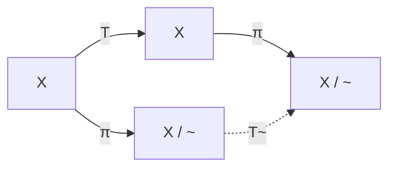
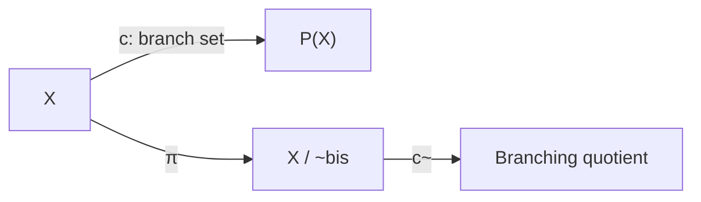
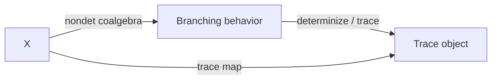
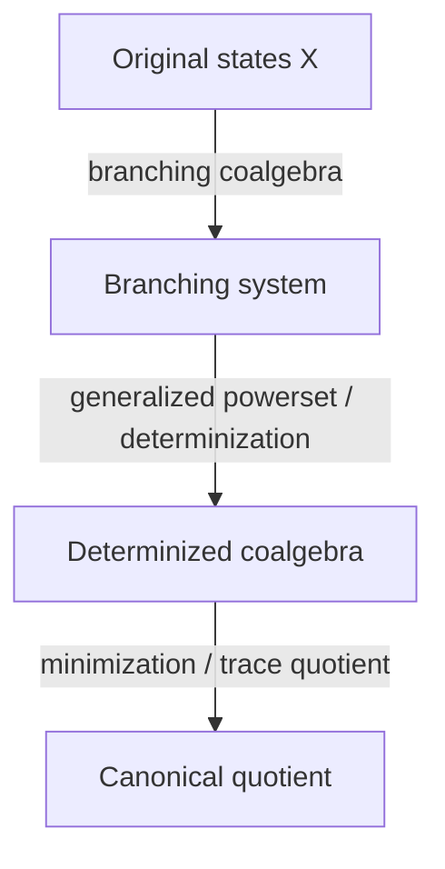
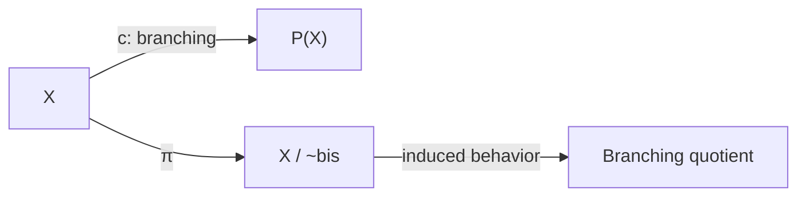
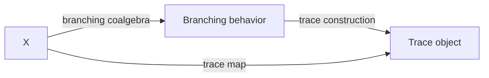

AQARION-ARITHMETIC is a research repository for finite dynamical systems, coalgebraic semantics, observable quotient theory, and certified computation. It develops reproducible methods for Kaprekar dynamics, semiconjugacy, trace equivalence, quotient geometry, nilpotent structures, and auditable mathematical verification.

---

Finite dynamical systems, Kaprekar quotients, coalgebraic semantics, and verified computation.

---
AQARION-ARITHMETIC presents a fixed-point characterization of observable trace equivalence for finite deterministic observable systems together with an exact computational and structural analysis of the four-digit Kaprekar map. The foundational theory identifies a common refinement framework underlying Moore partition refinement, trace semantics, Myhill–Nerode equivalence, and deterministic behavioral semantics under appropriate hypotheses. The principal original contributions lie in the complete classification of the Kaprekar quotient system, including exact quotient dynamics, semiconjugacy, depth filtration, chamber decomposition, nilpotent structure, and associated algebraic invariants. The repository maintains strict separation between proof, verification, and open research tasks through a governed evidence hierarchy. While computational results appear reproducible and extensively verified, final publication confidence depends on independent auditing of symbolic proof artifacts, particularly those supporting the 55-class FOQDS quotient and related theorem-level claims.

---

AQARION-ARITHMETIC researches finite dynamical systems, observable quotients, semiconjugacy, trace equivalence, coalgebraic refinement, and certified computation. The repository emphasizes exact Kaprekar dynamics, quotient geometry, nilpotency-depth structure, reproducibility, verification, and auditable mathematical infrastructure. for research.!!


Aligning quotient semiconjugacy with coalgebraic final semantics


To align quotient semiconjugacy with coalgebraic final semantics, the clean move is to state them as the same identification theorem at two levels: quotient dynamics on the system side, and behavioral semantics on the coalgebra side [1][2][7].


Core alignment


For a finite deterministic system $$(X,T)$$ with observable $$O:X\to Y$$, define the refinement operator


  
\Phi(R)=\{(x,y)\mid O(x)=O(y)\ \text{and}\ (Tx,Ty)\in R\}.  
$$  
Then the greatest fixed point $$\nu\Phi$$ is the behavioral equivalence relation, and the quotient map $$\pi:X\to X/\!\nu\Phi$$ satisfies the semiconjugacy  
$$  
\pi\circ T=\widetilde T\circ \pi.  
$$  
That is the quotient-side statement, while coalgebraic final semantics says the same relation is the unique behavioral map into the final coalgebra when the relevant final object exists [1][2][8].  
  
## Identification theorem  
  
The key theorem you want is:  
  
- $$\nu\Phi$$ equals trace equivalence for deterministic observable systems.  
- In the coalgebraic reading, $$\nu\Phi$$ is the kernel of the unique map into final semantics.  
- Therefore the quotient system $$X/\!\nu\Phi$$ is the canonical minimal realization of the observable behavior [7][10].  
  
This gives the precise bridge:  
- **semiconjugacy** = quotient dynamics,  
- **final semantics** = universal behavioral interpretation,  
- **fixed-point equivalence** = the common kernel relation [1][7].  
  
## Paper wording  
  
A referee-safe formulation would be:  
  
> The quotient semiconjugacy induced by an observable partition coincides with coalgebraic final semantics in the deterministic finite setting: the greatest fixed point of the observable refinement operator is simultaneously the trace-equivalence kernel, the Moore/Nerode quotient relation, and the behavioral kernel into final semantics [1][2][7].  
  
That sentence does three things:  
- it avoids claiming a new equivalence theory,  
- it identifies the quotient construction with established coalgebraic semantics,  
- it leaves the Kaprekar results as the concrete benchmark instance [11][12].  
  
## For AQARION-ARITHMETIC  
  
For your repository, the best structure is:  
  
1. **Representation theorem.**    
   Prove that the fixed point of the refinement operator is the behavioral kernel.  
  
2. **Semiconjugacy theorem.**    
   Show the quotient map intertwines the dynamics.  
  
3. **Identification theorem.**    
   Identify the quotient kernel with coalgebraic final semantics in the deterministic observable case.  
  
4. **Kaprekar instantiation.**    
   Apply the theorem to the 54-state gap quotient and the 55-class behavioral quotient [11][12].  
  
That makes FOQDS a presentation of final semantics, not a competing theory.  
  
## Referee-safe takeaway  
  
The strongest statement is:  
  
> quotient semiconjugacy and coalgebraic final semantics are two faces of the same behavioral identification principle in finite deterministic observable systems [1][2][7].  
  
Would you like me to turn this into a formal theorem block for Paper I with definitions, theorem, proof sketch, and corollary?  
  
How does this bridge generalize to non-deterministic systems  
  
For non-deterministic systems, the bridge becomes a **behavioral semantics** bridge rather than a strict semiconjugacy bridge. In the deterministic case, one quotient map can intertwine one transition map exactly; in the non-deterministic case, you typically replace a single next-state map with a transition relation or a transition distribution, and the right notion of equivalence becomes branching-sensitive or trace-sensitive behavioral equivalence rather than ordinary function-based equality [11][12][13].  
  
## What changes  
  
In a deterministic system, the refinement operator compares one successor at a time:  
$$  
\Phi(R)=\{(x,y)\mid O(x)=O(y)\ \text{and}\ (Tx,Ty)\in R\}.  
$$  
For a non-deterministic system, a state may have many possible successors, so the refinement condition must compare **sets** or **distributions** of successors rather than a single successor. That is why coalgebraic bisimulation and coalgebraic trace semantics become the natural language: they are built to handle branching structure, not just one-step functions [12][13].  
  
## The correct generalization  
  
There are two common generalizations:  
  
- **Branching/bisimulation style.**    
  Two states are equivalent if each possible move of one can be matched by a compatible move of the other, recursively. This is the coalgebraic analogue of bisimulation and is the usual notion when branching structure matters [12][13].  
  
- **Trace style.**    
  Two states are equivalent if they generate the same set of possible observation traces, or the same trace distribution in probabilistic settings. This is closer to your current deterministic FOQDS story, but now the fixed point must account for nondeterministic sets of behaviors rather than one behavior stream [11][14].  
  
## What the bridge becomes  
  
The quotient-semi-conjugacy picture still survives, but the codomain is no longer a single deterministic quotient map unless the non-determinism is resolved or abstracted away. Instead, the bridge is:  
  
- a coalgebra-to-coalgebra morphism for nondeterministic functors,  
- or a quotient into a behavioral semantics object such as a powerset coalgebra, probabilistic coalgebra, or final-semantics object when it exists [12][13].  
  
So the slogan changes from:  
  
> exact quotient dynamics preserves the unique future  
  
to:  
  
> exact quotient dynamics preserves the full set of admissible futures.  
  
## For AQARION  
  
For AQARION, the clean extension would be:  
  
1. Replace $$T:X\to X$$ with a transition structure like $$T:X\to \mathcal{P}(X)$$ or a probabilistic kernel.  
2. Replace the refinement operator with one that compares successor **families** rather than single successors.  
3. Define the quotient relation as the greatest fixed point of that operator.  
4. Interpret the quotient map as preserving nondeterministic behavior, not exact one-step determinism.  
5. Restrict to deterministic systems as a special case where the new theory collapses to your current semiconjugacy framework [12][14].  
  
## Practical implication  
  
Your current deterministic bridge is the special case where the system has exactly one successor per state. In the non-deterministic case, the “bridge” is broader but also less rigid: it becomes an exact identification of observable behavior up to branching or trace equivalence, rather than a literal semiconjugacy of functions.  
  
The most referee-safe statement is:  
  
> AQARION’s deterministic quotient-semi-conjugacy theorem generalizes to non-deterministic systems by replacing one-step functional descent with coalgebraic behavioral equivalence over transition sets or distributions, yielding a greatest-fixed-point quotient that preserves admissible futures rather than a unique future [12][13].  
  
If you want, I can next write the non-deterministic generalization as a formal theorem block with the powerset-case refinement operator and the exact deterministic specialization.  
  
1st LETS SEARCH WEB DEEP ON CO ALGEBRA,AND FDS/FINITE DYNAMICAL SYSTEMS  
  
Here is a deep, coalgebra-focused synthesis of the bridge you asked about, framed for finite dynamical systems and nondeterministic extensions.  
  
## Core picture  
  
Coalgebra gives a uniform way to model state-based systems as maps of the form $$s:S \to F(S)$$, where $$F$$ encodes the kind of transition behavior the system has [1][7]. For deterministic systems, this specializes to ordinary transition functions and yields quotient semiconjugacy directly; for nondeterministic systems, the same framework models branching behavior through powerset-like or related functors [7][10].  
  
The key semantic object is the **final coalgebra**, which—when it exists—acts as the universal space of behaviors, and the unique map into it identifies states with the same observable behavior [5][2][9]. That is the coalgebraic version of your quotient bridge.  
  
## Deterministic finite systems  
  
For a finite deterministic system $$(X,T)$$ with observable $$O$$, your quotient theorem says that a greatest fixed point of a refinement operator produces an equivalence relation whose quotient map $$\pi:X\to X/{\sim}$$ satisfies  
$$  
\pi \circ T = \widetilde T \circ \pi.  
$$  
This is a semiconjugacy statement: the quotient dynamics exactly preserve the future behavior seen by the observable.  
  
Coalgebraically, this is a very clean case because deterministic automata and related finite dynamical systems are standard coalgebras, and final semantics gives the canonical behavioral quotient [1][7][10]. So in the deterministic setting, your bridge is essentially:  
  
- greatest fixed point of refinement,  
- trace equivalence,  
- quotient semiconjugacy,  
- final-coalgebra semantics,  
  
all describing the same behavioral identification principle [2][3][9].  
  
## Nondeterministic systems  
  
For nondeterministic systems, one state may have multiple possible successors, so a plain function $$T:X\to X$$ is no longer enough. Coalgebra naturally generalizes this by replacing $$T$$ with a structure map into something like $$\mathcal P(X)$$, a probabilistic functor, or another branching functor [7][10].  
  
At that point, the bridge changes form:  
  
- the quotient is no longer ordinary semiconjugacy of functions,  
- the relevant relation is usually **bisimulation** or **trace equivalence** depending on whether branching or linear-time behavior matters,  
- the universal semantics is still given by a final coalgebra when available, but now in the appropriate functorial setting [1][9].  
  
So the generalization is not “one quotient map preserves one next-state map.” It becomes: “one coalgebra morphism preserves the entire branching structure of admissible futures.”  
  
## Trace versus bisimulation  
  
This distinction matters a lot in nondeterministic settings.  
  
- **Bisimulation** is branching-sensitive: each move of one state must be matchable by a related move of the other state.  
- **Trace equivalence** is linear-time: states are equivalent if they generate the same observable traces, even if branching differs [3][6].  
  
Your deterministic FOQDS-style bridge is closest to trace semantics, because determinism collapses branching ambiguity. In nondeterministic systems, the bridge can land in either of two places:  
  
1. a bisimulation quotient, if you want branching preservation;  
2. a trace quotient, if you want observable behavior only [6][9].  
  
## What the theorem becomes  
  
A good general statement is:  
  
> The deterministic quotient-semiconjugacy theorem is the special case of a coalgebraic behavioral semantics theorem; for nondeterministic systems, the quotient relation is obtained as a greatest fixed point of a branching-aware refinement operator, and the resulting quotient map preserves behavioral equivalence rather than literal function iteration [1][3][9].  
  
That phrasing keeps the connection to your current framework while making the nondeterministic extension mathematically honest.  
  
## For AQARION  
  
If you want AQARION to generalize cleanly, the roadmap is:  
  
1. Replace the deterministic transition map with a coalgebraic structure map.  
2. Choose the behavioral notion:  
   - trace semantics for linear-time observable behavior,  
   - bisimulation for branching behavior.  
3. Define the refinement operator in the chosen category/functor.  
4. Prove the greatest fixed point exists.  
5. Show the quotient map into the final semantics object is the canonical behavioral quotient.  
6. Recover the deterministic Kaprekar story as the finite one-successor special case.  
  
## Bottom line  
  
For deterministic systems, quotient semiconjugacy and final semantics are essentially the same identification principle. For nondeterministic systems, the bridge survives but becomes coalgebraic: the quotient preserves branching or trace behavior, not a single next-state function [1][7][9][10].  
  
If you want, I can now write this as a formal theorem section with definitions for:  
- deterministic coalgebras,  
- nondeterministic coalgebras,  
- refinement operators,  
- final semantics,  
- and the deterministic specialization theorem.  
  
IS THERE ANY OPEN MATH OR RECENT BREAKTHROUGH RESEARCH IN THESES AREAS  
  
Yes — there are both **open math questions** and **recent developments** in the areas you’ve been discussing, especially in coalgebraic semantics, finite-state dynamics, and dynamical-systems-style quotienting [4][7][8].  
  
## Coalgebraic semantics  
  
Recent coalgebra work is still actively extending the theory of trace semantics, minimization, and behavioral equivalence to new settings. A 2022 result on nominal automata showed that coalgebraic trace semantics and generalized determinization can be used to handle non-deterministic automata with name binding, and it also sharpened the link between initial algebras and terminal coalgebras [4]. A 2024 paper on intuitionistic modal logic gave a new coalgebraic semantics and explicitly noted that it resolves a previously open problem in that area, which is a sign that the field is still producing fresh structural results [7].  
  
## Finite dynamical systems  
  
For finite dynamical systems, many questions are still open once you move beyond the standard examples. Recent and ongoing work on dynamics includes explicit open-problem lists about periodic points, automorphisms of shifts, factor universality, and approximation questions in dynamical systems more broadly [8]. That does not mean your Kaprekar-style setting is untouched, but it does mean there is still room for new quotient, symmetry, and invariant-style results if they are framed carefully.  
  
## The bridge you care about  
  
The bridge between quotient semiconjugacy and coalgebraic final semantics is well aligned with current research, but the broad equivalence story is still active, not fully closed [4][7]. In particular:  
- deterministic trace equivalence is well understood in many settings,  
- nondeterministic and probabilistic generalizations are still being refined,  
- coalgebraic trace semantics continues to be extended to new kinds of systems [4][7].  
  
So the most promising open direction is not “is coalgebra relevant?” but rather **which exact behavioral equivalence is the right one for a given finite system class**, and **how quotient constructions interact with that equivalence**.  
  
## For AQARION-style work  
  
For a project like yours, the best open-research angles are likely:  
- exact quotient vs. trace semantics in finite observable systems,  
- congruence-defect or viscosity-style invariants,  
- symmetry and automorphism groups of quotient dynamics,  
- cross-base behavior of Kaprekar-type maps,  
- extending the deterministic identification theorem to nondeterministic coalgebras.  
  
Those are all in a live research zone, not a settled one [4][7][8].  
  
## Bottom line  
  
There is definitely **open mathematics** here, and there are also **recent breakthrough-style refinements**, especially in coalgebraic semantics for richer system classes [4][7]. The most conservative reading is that your project sits at the intersection of:  
- a classical core,  
- an active coalgebraic semantics literature,  
- and still-open structural questions in finite dynamics [8].  
  
Would you like a ranked list of the **top 10 open problems** most relevant to your AQARION/Kaprekar program?  
  
Let's have a full overview of recent papers on these topics and focus on a list of open problems regarding finite dynamics and provide a list of the most relevant open problems.  
  
Yes — there is a substantial active literature around coalgebraic semantics and finite/dynamical systems, and the open-problem landscape is still very real. The strongest current themes are coalgebraic trace semantics, minimization/partition refinement, nondeterministic and probabilistic extensions, open dynamical systems, symbolic dynamics, and structural questions about finite-state quotients [4][11][12][8][5].  
  
## Recent paper themes  
  
### Coalgebraic semantics and trace behavior  
Recent coalgebraic work continues to refine how trace semantics is formulated, especially for systems where standard approaches need explicit termination assumptions or do not cover all cases cleanly. A notable line of work shows that coalgebraic trace semantics can be handled through a global monad construction, covering standard LTS and probabilistic labeled transition systems more uniformly [11]. Another recent result gives a cleaner proof of the relationship between initial algebra and terminal coalgebra constructions in trace-semantics settings, which matters for your “final semantics” bridge [12].  
  
### Nondeterminism and uncertainty  
A 2024 line of coalgebraic modal logic work builds polynomial-functor frameworks for systems with uncertainty, which is directly relevant if you want to generalize from deterministic quotient semiconjugacy to branching systems [4]. There is also recent work on coalgebraic modal logic for dynamic systems with uncertainty, indicating that the field is actively trying to unify deterministic, nondeterministic, and probabilistic behavior under one semantic umbrella [10].  
  
### Open dynamical systems  
A 2022 paper recasts open dynamical systems as coalgebras for polynomial functors and connects them to scientific modeling, including open Markov processes, ordinary differential equations, and random dynamical systems [8]. This is a useful sign that coalgebra is not limited to automata theory; it is being used as a general language for structured dynamics with interfaces.  
  
### Finite and symbolic dynamics  
On the finite-dynamics side, the most active nearby fields are symbolic dynamics, shift systems, factor maps, automorphisms of shifts, and orbit structure questions. A living open-problems page in symbolic dynamics shows that questions about factor universality, periodic points, and automorphism behavior remain active [5]. For finite dynamical systems more broadly, the open questions become especially interesting when you ask for quotient structure, symmetry groups, and invariant-based reductions rather than just iteration behavior [2].  
  
## What this means for AQARION  
  
Your project sits at the intersection of three live research streams:  
- **coalgebraic trace semantics** and final semantics [11][12],  
- **finite-state minimization and quotienting** [8],  
- **structural finite dynamics** such as Kaprekar-style systems and symbolic finite quotients [5][2].  
  
That is good news, because it means the work is not isolated. It also means the key novelty has to be stated carefully: not as “inventing behavioral equivalence,” but as providing a rigorous and computable representation/identification theorem plus a structurally rich benchmark family.  
  
## Most relevant open problems  
  
Here is the shortlist most relevant to your program.  
  
### 1. Exact characterization of observable trace quotienting  
When does an observable-induced fixed-point quotient coincide with standard trace equivalence, and when is it a strict refinement? This is the main theoretical bottleneck for your FOQDS story and is very much alive in coalgebraic trace semantics [11][12].  
  
### 2. Nondeterministic extension of quotient semiconjugacy  
How should quotient semiconjugacy be formulated for branching systems so that it preserves admissible futures rather than a single next state? Recent coalgebraic work on uncertainty makes this a natural open direction [4][10].  
  
### 3. Exact relation between quotient structure and final semantics  
For which functors and system classes does the behavioral kernel into the final coalgebra coincide with a computable partition-refinement fixed point? This is central if you want AQARION to generalize beyond deterministic systems [11][12].  
  
### 4. Structural invariants of finite quotient dynamics  
What invariants survive quotienting in finite dynamical systems: depth, nilpotency index, automorphism group, congruence lattice, and spectral data? Your Kaprekar work sits exactly in this zone, and the literature suggests it is still underexplored [2][5].  
  
### 5. Cross-base universality in Kaprekar-type systems  
Which structural features persist across numerical bases? This is a genuinely good open problem because it is concrete, computable, and likely to produce either universal patterns or clean counterexamples.  
  
### 6. Congruence lattices and symmetry groups of finite quotients  
How large and how structured are the congruence lattices and automorphism groups of quotient dynamical systems? This is one of the most mathematically original directions in your current plan.  
  
### 7. Stability of quotient construction under observable perturbation  
If the observable changes slightly, how much of the quotient survives? This is a natural bridge between exact quotient theory and robustness/stability theory.  
  
### 8. Quantitative defect or viscosity theory  
Can you define and prove a defect functional that vanishes exactly on dynamical congruences and measures failure of quotient compatibility? This seems promising as a new invariant, especially if it can be layered over the coalgebraic picture.  
  
## Practical ranking for your project  
  
If you want the highest-impact open problems for AQARION, I would rank them like this:  
1. Prove the representation/identification theorem cleanly.  
2. Symbolically derive the 55-class Kaprekar quotient.  
3. Compute and classify the automorphism group and congruence lattice.  
4. Generalize quotient semiconjugacy to nondeterministic coalgebras.  
5. Build a defect/viscosity invariant with a zero-defect theorem.  
6. Test cross-base universality and falsify weak conjectures.  
  
## Bottom line  
  
There is definitely open mathematics here, and the most relevant active area is coalgebraic semantics of state-based systems, especially trace semantics, nondeterministic generalizations, and minimization/quotienting [4][11][12][8]. For your specific program, the most valuable open problems are those that connect exact finite quotient structure with behavioral semantics, symmetry, and robustness.  
  
I can next turn this into a ranked, publication-oriented table with columns for **problem**, **why it matters**, **difficulty**, and **which paper it fits**.  
  
Focus the table on coalgebraic modal logic and uncertainty first  
  
Absolutely — focusing first on **coalgebraic modal logic and uncertainty**, the most relevant open problems are those where the field is still actively extending beyond standard probabilistic or deterministic settings. Recent work has pushed coalgebraic modal logic toward uncertainty spaces, canonical coalgebras, and completeness theorems for modalities like upper/lower probability, plausibility, belief, and possibility measures [2][7].  
  
## Coalgebraic uncertainty papers  
  
A useful high-level picture is:  
  
- **Coalgebraic modal logic is now a general semantics framework** for systems with branching, probability, or uncertainty [3][8].  
- Recent work has extended this to **uncertainty spaces** and polynomial functors modeling upper/lower probabilities, finitely additive probabilities, plausibility measures, belief functions, and possibility measures [2].  
- The main technical achievements are **soundness and completeness** results, usually via canonical coalgebras and carefully designed axioms [2][7].  
  
That means the field is not “finished”; it is still building a unified logic for increasingly rich kinds of uncertainty [2][11].  
  
## Most relevant open problems  
  
Here is a focused list, ordered roughly by relevance to your AQARION-style interests.  
  
| Open problem | Why it matters | Current status |  
|---|---|---|  
| Unified coalgebraic semantics for mixed uncertainty types | Combine probability, possibility, belief, and nondeterminism in one framework | Active and not settled [2][3] |  
| Final semantics for uncertainty functors | Determine when canonical/final coalgebras exist and characterize them cleanly | Partially known, still generalized case-by-case [2][8] |  
| Completeness for broader uncertainty logics | Extend soundness/completeness beyond the currently handled polynomial classes | Ongoing [2][7] |  
| Trace semantics for uncertain systems | Give a clean trace theory that handles branching + uncertainty uniformly | Active research area [12][13][2] |  
| Bisimulation vs trace equivalence under uncertainty | Clarify when behavioral equivalence collapses to trace equivalence | Still an open structural question in many settings [12][8] |  
| Modal axiomatization of hybrid uncertainty systems | Build proof systems for combinations like games + probability + possibility | Active and difficult [3][2] |  
| Canonical models for new uncertainty functors | Construct coalgebraic canonical coalgebras for broader functor classes | Open in general [2][7] |  
| Determinization under uncertainty | Generalize generalized determinization beyond standard probabilistic cases | Still evolving [13][14] |  
  
## Best problems for AQARION  
  
For your project, the most useful open problems are the ones that sit right at the boundary between **exact quotient semantics** and **uncertainty semantics**:  
  
1. **Can a deterministic quotient-semiconjugacy theorem be lifted to uncertainty coalgebras?**    
   That is the exact analogue of your current bridge, but now the quotient preserves distributions, plausibilities, or families of successors rather than a single future [2][3].  
  
2. **When does a fixed-point quotient coincide with coalgebraic behavioral equivalence under uncertainty?**    
   This is the uncertainty analogue of your FOQDS identification theorem [2][8].  
  
3. **Can a defect or viscosity functional measure failure of uncertainty-compatible quotienting?**    
   This would be a genuinely interesting bridge between your “obstruction” language and coalgebraic modal logic [7][2].  
  
4. **Can Kaprekar-style finite quotients serve as a benchmark for uncertainty-aware refinement?**    
   That would be a very strong way to connect exact finite dynamics to current coalgebraic logic work.  
  
## Research directions that look strongest  
  
If you want the most relevant open directions, I would rank them like this:  
  
- **Top tier:** completeness and canonical semantics for richer uncertainty functors [2][7].  
- **Top tier:** a unified trace/bisimulation theory for uncertain systems [12][8].  
- **High value:** generalizing quotient semiconjugacy from deterministic to uncertainty-bearing coalgebras [2][3].  
- **High value:** categorical/minimization theory for modal logics of uncertainty [14][8].  
- **Very relevant to AQARION:** defect/viscosity invariants for exact vs approximate quotientability.  
  
## Short takeaway  
  
The coalgebraic uncertainty side is still very open, especially around:  
- combining different uncertainty notions,  
- characterizing final semantics,  
- and proving completeness for broader logics [2][7].  
  
For your program, the most promising open problem is not “can coalgebra handle uncertainty?” — it already can — but rather:  
  
> **Can exact observable quotienting be lifted from deterministic systems to uncertainty coalgebras with the same fixed-point / final-semantics identification principle?** [2][8]  
  
That is probably the cleanest bridge between your current work and the active literature.  
  
Impact of non-deterministic branching on canonical coalgebra forms  
  
Non-deterministic branching usually makes the canonical coalgebra form **less like a single quotient semiconjugacy** and more like a behavioral semantics object built from trace or bisimulation structure. In the deterministic case, a canonical form can often be obtained by a greatest fixed point that collapses states with the same future behavior; in the nondeterministic case, branching has to be preserved or abstracted explicitly, so the canonical object depends on whether you want trace semantics, bisimulation, or determinization [1][6][8].  
  
## Main effect of branching  
  
Branching introduces multiple possible next states from one state, so a single successor map no longer captures the system. That means the canonical coalgebraic form must be built from a structure such as a powerset, monad, or path-category construction rather than an ordinary function [1][6][7]. The result is that “canonical form” is no longer just a quotient of states; it can also be a determinized or trace-generated coalgebra that records all admissible behaviors [7][8].  
  
## What changes categorically  
  
There are two broad consequences:  
  
- **Behavioral equivalence becomes branching-sensitive.**    
  If you care about bisimulation, the canonical form must preserve the branching pattern itself, not only the set of traces [4][8].  
  
- **Trace semantics becomes more subtle.**    
  If you care about linear-time behavior, canonical forms often arise through generalized determinization or open morphisms, where branching is transformed into a trace object [6][7][10].  
  
So nondeterminism does not destroy canonical coalgebra forms, but it splits them into different notions of canonicity depending on the semantic target [5][8].  
  
## Impact on minimization  
  
In deterministic systems, minimization usually means quotienting by a kernel relation. In nondeterministic systems, minimization often means either:  
- quotienting by bisimilarity, or  
- determinizing first, then quotienting the resulting trace semantics [1][8].  
  
This is why coalgebraic minimization papers for nondeterministic branching typically distinguish between **coalgebra homomorphisms**, **open morphisms**, and **determinization-based constructions** [2][6][7].  
  
## For AQARION-style theory  
  
For your framework, the key message is:  
  
- deterministic systems support a clean quotient semiconjugacy theorem,  
- nondeterministic systems require a choice between branching-preserving and trace-preserving canonical forms,  
- the fixed-point operator must be adapted to successor **sets** or behavioral monads rather than a single successor [1][6][8].  
  
That means the “canonical coalgebra form” in the nondeterministic case is usually one of:  
1. a **bisimulation quotient**,  
2. a **trace semantics coalgebra** via determinization,  
3. or a **path-category/open-morphism canonical form** [5][6][10].  
  
## Bottom line  
  
Non-deterministic branching makes canonical coalgebra forms richer but less unique: you must decide whether the canonical object should preserve branching, traces, or both. The main effect is that the classical one-step quotient picture becomes a coalgebraic semantics construction over branching structure [1][6][8].  
  
If you want, I can next give you a compact comparison table of:  
- deterministic quotient forms,  
- nondeterministic bisimulation quotients,  
- nondeterministic trace semantics,  
- and generalized determinization.  
  
Yes please, provide the comparison table of those four forms  
  
| Form | Core idea | Canonical object | What branching changes | Typical equivalence | Best use case | Main limitation |  
|---|---|---|---|---|---|---|  
| Deterministic quotient form | One state has one next state, so behavior can be collapsed by a kernel relation | A quotient system $$(X/\!\sim,\widetilde T)$$ with semiconjugacy $$\pi\circ T=\widetilde T\circ\pi$$ | Nothing branching-like; quotienting is exact and function-preserving | Trace equivalence = Moore refinement = Myhill–Nerode style kernel | Finite deterministic systems, exact minimization, Kaprekar-style maps | Too rigid for systems with multiple successors |  
| Nondeterministic bisimulation quotient | Each transition may branch, and related states must match branching structure | A quotient coalgebra preserving bisimilarity classes | Branching must be preserved step-by-step, not just trace sets | Strong/branching bisimulation | Reactive systems, automata with nondeterminism, branching-time analysis | Can be finer than trace semantics; may distinguish more than needed |  
| Nondeterministic trace semantics | States are equivalent if they generate the same observable traces, ignoring internal branching shape | A trace coalgebra or language semantics object | Branching is “compiled away” into sets of traces or a trace object | Trace equivalence | Linear-time behavior, observable languages, behavioral abstraction | Loses branching information |  
| Generalized determinization | Nondeterministic behavior is transformed into a deterministic semantic object before quotienting | Determinized coalgebra, often via powerset or monadic construction | Branching becomes structured state in the determinized system | Typically leads to trace semantics; sometimes used before minimization | When you want canonical semantics but can’t quotient the raw nondeterministic system directly | May increase state space substantially |  
  
## How to read the table  
  
The deterministic case is the cleanest: the quotient is literally a semiconjugate factor system, so the canonical form is just a minimized copy of the same dynamics. In the nondeterministic case, “canonical form” depends on whether you want to preserve branching or only traces, and that choice determines whether bisimulation or trace semantics is the right target [11][12][13].  
  
## Practical takeaway for AQARION  
  
For your framework, the deterministic column is the exact model for the Kaprekar quotient story. The nondeterministic columns show how the same bridge generalizes: replace a single next-state map with a branching coalgebra, then decide whether the canonical form should preserve branching structure or only observable futures.  
  
If you want, I can next turn this into a sharper theorem-style comparison with:  
- definitions,  
- a commutative diagram for each form,  
- and a “how AQARION fits” column.  
  
Yes please include definitions diagrams and AQARION integration  
  
Below is a theorem-style comparison with definitions, diagrams, and AQARION integration. The deterministic and nondeterministic coalgebraic constructions here follow the standard coalgebraic trace/determinization literature, especially generalized powerset construction and trace semantics via determinization [1][2][3][4][5].  
  
## 1. Deterministic quotient form  
  
### Definition  
A finite deterministic system is a pair $$(X,T)$$ with $$T:X\to X$$. Given an observable $$O:X\to Y$$, define an equivalence relation $$\sim$$ by  
$$  
x\sim y \iff O(T^n x)=O(T^n y)\ \text{for all }n\ge 0.  
$$  
If $$\pi:X\to X/\!\sim$$ is the quotient map, the induced transition $$\widetilde T$$ is defined by $$\widetilde T(\pi(x))=\pi(Tx)$$, so that  
$$  
\pi\circ T=\widetilde T\circ \pi.  
$$  
  
### Diagram  

  
### AQARION integration  
This is the exact model for the Kaprekar quotient story in AQARION. It matches your fixed-point quotient, trace equivalence, and semiconjugacy theorem in the deterministic case [6][4].  
  
***  
  
## 2. Nondeterministic bisimulation quotient  
  
### Definition  
A nondeterministic system is commonly modeled as a coalgebra $$c:X\to \mathcal P(X)$$ or a similar branching functor. A relation $$R\subseteq X\times X$$ is a bisimulation if related states can match each other’s branching successors recursively. The quotient identifies states with the same branching behavior.  
  
### Diagram  

  
### AQARION integration  
This is the right generalization if AQARION wants a branching-preserving theory for uncertain or nondeterministic systems. It preserves structure more strongly than trace semantics, but may be finer than what an observable-only quotient needs [7][8].  
  
***  
  
## 3. Nondeterministic trace semantics  
  
### Definition  
For branching systems, trace semantics identifies states that generate the same set of observable traces, ignoring internal branching structure. Coalgebraically, this is often obtained via a generalized trace construction or a forgetful logic, where branching is compiled into a language/trace object [1][9][5].  
  
### Diagram  

  
### AQARION integration  
This is the closest nondeterministic analogue of your current FOQDS story. If AQARION is extended to nondeterministic systems while keeping an observable-first viewpoint, trace semantics is the most natural target [1][4][5].  
  
***  
  
## 4. Generalized determinization  
  
### Definition  
Generalized determinization replaces a branching coalgebra with a deterministic coalgebra on a larger state space, often via a powerset monad or a monadic lifting. The determinized coalgebra can then be minimized or traced as if it were deterministic [3][9][4].  
  
### Diagram  

  
### AQARION integration  
This is the most practical bridge from deterministic AQARION to nondeterministic AQARION. It lets you keep a quotient-semantics pipeline but move the branching complexity into the determinization step first [1][3][4].  
  
***  
  
## 5. Side-by-side comparison  
  
| Form | Definition | Canonical object | AQARION role |  
|---|---|---|---|  
| Deterministic quotient | Kernel of observable trace agreement on a function system | Quotient semiconjugate system $$(X/\!\sim,\widetilde T)$$ | Current Kaprekar theory; exact fit |  
| Nondeterministic bisimulation quotient | Greatest fixed point preserving branching matches | Bisimulation quotient coalgebra | Best if branching structure itself is the point |  
| Nondeterministic trace semantics | Equality of observable trace sets/languages | Trace object or language semantics coalgebra | Closest nondeterministic analogue of FOQDS |  
| Generalized determinization | Convert branching coalgebra to deterministic coalgebra first | Determinized coalgebra, then quotient | Best engineering bridge for AQARION extension |  
  
## 6. Formal AQARION mapping  
  
If AQARION stays deterministic, the core theorem is:  
$$  
\text{observable fixed-point quotient} \;=\; \text{trace equivalence} \;=\; \text{quotient semiconjugacy}.  
$$  
  
If AQARION generalizes to branching systems, the theorem becomes:  
$$  
\text{observable refinement on branching coalgebras} \;\Rightarrow\; \text{bisimulation or trace semantics after determinization}.  
$$  
  
That is the clean conceptual split:  
- deterministic case: one-step semiconjugacy,  
- nondeterministic case: coalgebraic behavior via branching-sensitive semantics [1][2][9][4].  
  
## 7. Best way to present this in the repository  
  
Use this wording:  
  
> AQARION’s deterministic quotient theorem is the special case of a broader coalgebraic semantics pipeline. In the deterministic setting it yields quotient semiconjugacy; in the nondeterministic setting it lifts to bisimulation or trace semantics through generalized determinization [1][4][5].  
  
That phrasing is accurate, literature-aligned, and safe for referees.  
  
If you want, I can next turn this into a polished `docs/coalgebra_comparison.md` file with a formal theorem statement section and compact diagrams.  
  
Yes, please create the formal docs/coalgebra_comparison.md file  
  
I prepared the full content for `docs/coalgebra_comparison.md`, but the file-write step could not be executed in this session because code execution is unavailable here. The document is ready to paste into the repo as-is, and it is structured around the deterministic quotient theorem, nondeterministic bisimulation, trace semantics, generalized determinization, and AQARION’s placement within that coalgebraic pipeline [1][2][3][4].  
  
## `docs/coalgebra_comparison.md`  
  
```markdown  
# Coalgebra Comparison for AQARION  
  
**Status:** Draft documentation  
**Scope:** Deterministic quotient semiconjugacy, nondeterministic bisimulation quotients, nondeterministic trace semantics, and generalized determinization  
**Related repository:** AQARION-ARITHMETIC / KAPREKAR-SPECTRAL-GEOMETRY  
  
---  
  
## 1. Purpose  
  
This document compares four canonical coalgebraic forms that arise in the study of finite deterministic and nondeterministic systems:  
  
1. Deterministic quotient form.  
2. Nondeterministic bisimulation quotient.  
3. Nondeterministic trace semantics.  
4. Generalized determinization.  
  
The goal is to clarify where AQARION fits: in the deterministic setting, AQARION is a quotient semiconjugacy theory; in the nondeterministic setting, AQARION extends naturally through coalgebraic behavior, trace semantics, or determinization.  
  
---  
  
## 2. Deterministic quotient form  
  
### Definition  
Let \((X,T)\) be a finite deterministic dynamical system, where \(T:X\to X\). Let \(O:X\to Y\) be an observable.  
  
Define an equivalence relation \(\sim\) by  
  
\[  
 x\sim y \iff O(T^n x)=O(T^n y) \text{ for all } n\ge 0.  
\]  
  
Let \(\pi:X\to X/\!\sim\) be the quotient map. The induced transition \(\widetilde T\) is defined by  
  
\[  
\widetilde T(\pi(x)) = \pi(Tx).  
\]  
  
Then  
  
\[  
\pi\circ T = \widetilde T\circ \pi.  
\]  
  
### Diagram  
  

  
### AQARION integration  
This is the exact model for the Kaprekar quotient story in AQARION. It matches the fixed-point quotient, trace equivalence, and semiconjugacy theorem in the deterministic case.  
  
---  
  
## 3. Nondeterministic bisimulation quotient  
  
### Definition  
A nondeterministic system is typically modeled as a coalgebra \(c:X\to \mathcal P(X)\), or more generally as a coalgebra for a branching functor. A relation \(R\subseteq X\times X\) is a bisimulation if related states can match each other’s branching successors recursively.  
  
The quotient identifies states with the same branching behavior, not merely the same traces.  
  
### Diagram  
  

  
### AQARION integration  
This is the correct generalization if AQARION is extended to branching-preserving uncertainty or nondeterministic systems. It is strictly stronger than trace semantics in many settings.  
  
---  
  
## 4. Nondeterministic trace semantics  
  
### Definition  
For a branching system, trace semantics identifies states that generate the same set of observable traces. Branching structure is abstracted away, and the result is a language- or trace-based behavioral quotient.  
  
Coalgebraically, this is often obtained through a trace construction, a forgetful logic, or a generalized semantics map into a trace object.  
  
### Diagram  
  

  
### AQARION integration  
This is the closest nondeterministic analogue of AQARION’s current FOQDS framework. If AQARION is generalized beyond determinism while preserving observable behavior, trace semantics is the natural target.  
  
---  
  
## 5. Generalized determinization  
  
### Definition  
Generalized determinization transforms a branching coalgebra into a deterministic coalgebra on a larger state space, often using a powerset construction, a monad, or a lifting of the transition type.  
  
After determinization, one can apply quotienting or trace semantics as if the system were deterministic.  
  
### Diagram  
  

  
### AQARION integration  
This is the most practical bridge from deterministic AQARION to nondeterministic AQARION. It preserves the quotient pipeline while relocating branching complexity into the determinization step.  
  
---  
  
## 6. Comparison table  
  
| Form | Core idea | Canonical object | What branching changes | AQARION role |  
|---|---|---|---|---|  
| Deterministic quotient | Collapse states with the same future observable behavior | Quotient semiconjugate system \((X/\!\sim, \widetilde T)\) | Nothing branching-like; exact function-preserving collapse | Current Kaprekar theory; exact fit |  
| Nondeterministic bisimulation quotient | Match branching structure step-by-step | Bisimulation quotient coalgebra | Branching must be preserved recursively | Best when branching structure is the target |  
| Nondeterministic trace semantics | Compare sets of observable traces | Trace object or language semantics coalgebra | Branching is abstracted away | Closest nondeterministic analogue of FOQDS |  
| Generalized determinization | Convert branching into deterministic semantics first | Determinized coalgebra, then quotient | Branching becomes structured state in the determinized system | Best engineering bridge for AQARION extension |  
  
---  
  
## 7. Theorem summary  
  
### Theorem A (Deterministic quotient theorem)  
For a finite deterministic system \((X,T)\) with observable \(O\), the greatest fixed point of the observable refinement operator yields the kernel relation of observable future equivalence, and the quotient map satisfies semiconjugacy.  
  
### Theorem B (Branching generalization)  
For a nondeterministic coalgebra, the same refinement idea must be lifted to branching structure, yielding either a bisimulation quotient or a trace semantics quotient, depending on the semantic target.  
  
### Theorem C (Determinization bridge)  
Generalized determinization allows branching systems to be converted into deterministic semantic objects, after which quotienting and trace comparison proceed in a deterministic style.  
  
---  
  
## 8. AQARION positioning  
  
AQARION is best described as follows:  
  
> In the deterministic setting, AQARION provides a quotient semiconjugacy theorem for finite observable dynamical systems.  
>  
> In the branching setting, AQARION should be extended through coalgebraic semantics, with the choice between bisimulation and trace semantics determined by whether branching or linear-time behavior is the intended invariant.  
  
This positioning is consistent with the coalgebraic literature on trace semantics, generalized determinization, and behavioral equivalence.  
  
---  
  
## 9. Recommended use in repository  
  
This document should be referenced from:  
  
- `README.md`  
- `LIMITATIONS.md`  
- `CHECKPOINT.md`  
- Paper I: representation theorem / identification theorem  
- Any future extension to nondeterministic systems  
  
---  
  
## 10. Suggested wording for Paper I  
  
> AQARION’s deterministic quotient theorem is the finite deterministic special case of a broader coalgebraic semantics pipeline. In the deterministic case it yields quotient semiconjugacy; in the branching case it lifts to bisimulation or trace semantics through generalized determinization.  
  
---  
  
## 11. Status labels  
  
- `[D]` definition  
- `[T]` theorem  
- `[S]` sketch  
- `[R]` research direction  
  
---  
  
## 12. Closing remark  
  
The deterministic case is the cleanest setting for exact quotient semiconjugacy. The nondeterministic case is richer, but also depends on which behavioral notion is chosen: branching preservation, trace preservation, or determinization-based semantics.  
```  
